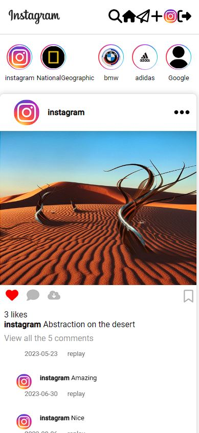
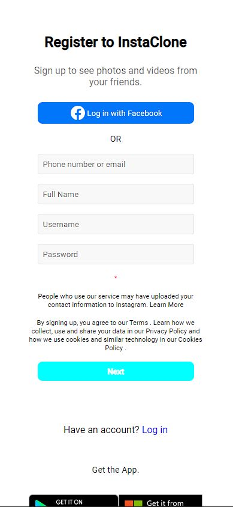
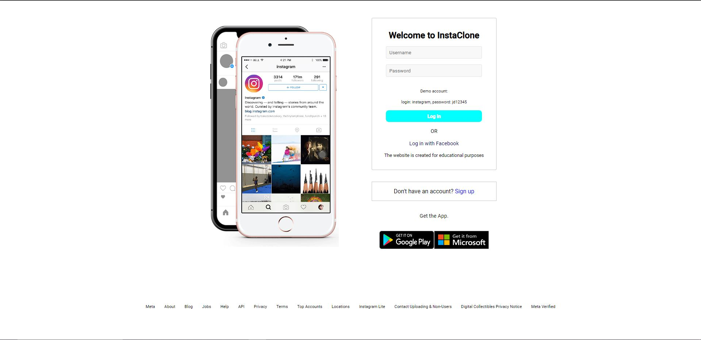
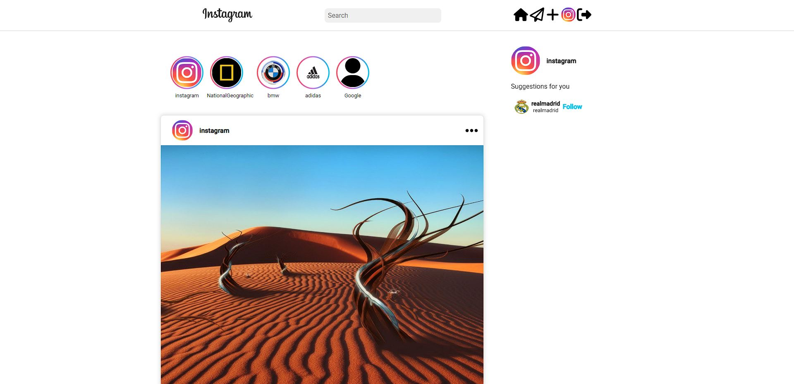
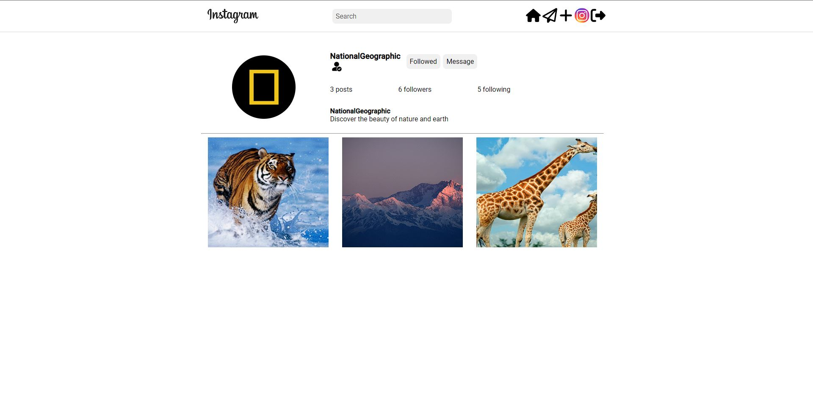
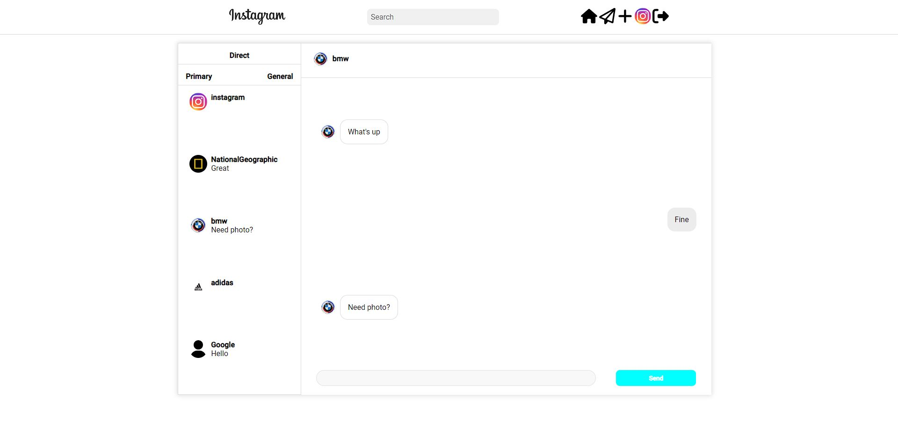
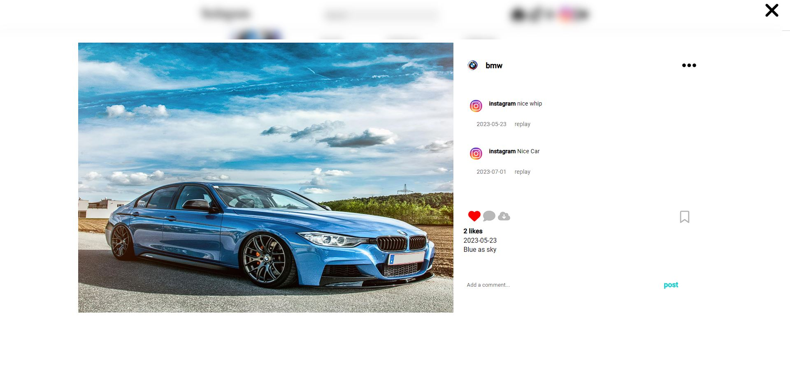

# InstaClone

## Description
InstaClone is a feature-rich web application that emulates the core functionalities of the popular social media platform, Instagram. With InstaClone, users can create profiles, share photos, follow other users, and engage with a vibrant community. Whether you're looking to connect with friends, share your creative work, or explore captivating content, InstaClone provides a familiar and enjoyable experience.

## Features
- User Profiles: Create your own personalized profile, complete with a profile picture, bio, and links to your other social media accounts. Showcase your personality and connect with other users through your profile.
- Photo Sharing: Upload and share your favorite moments through photos.
- Follow and Be Followed: Connect with friends, family, and other users by following their profiles. Stay updated with their latest posts, like and comment on their content, and build a network of followers.
- Explore Page: Find new users and content through the Explore page. Discover trending posts, popular hashtags, and recommended profiles based on your interests and activity.
- Direct Messaging: Communicate privately with other users through direct messages. Share photos, videos, and text messages, create group conversations, and stay connected with your contacts.
- Search Functionality: Easily find users, posts, and hashtags through the powerful search feature. Discover specific content or explore a particular topic of interest.
- Responsive Design: Access InstaClone from any device, including desktops, laptops, tablets, and smartphones. The responsive design ensures an optimized experience across various screen sizes.

## Mobile View
<table>
  <tr>
    <td valign="top"></td>
    <td valign="top"></td>
    <td valign="top"></td>
  </tr>
</table>

## Desktop View

### Login page

  

### Home page

  

### Account page

  

### Messages page

  

### Post page

  

## Technologies Used
### Front-end:
- React: A JavaScript library for building user interfaces.
- CSS: Scss styled-components.
- React Router: For handling routing within the application.
- Axios: A promise-based HTTP client for making API requests.
- Context: Context api react to store user.
- Http-polling: Http polling to update data.
- Websockets: To messages between users.
### Back-end:
- Node.js: A JavaScript runtime for server-side development.
- Express.js: A minimalistic web framework for Node.js.
- MongoDB: A NoSQL database for storing data.
- Mongoose: An ODM (Object Data Modeling) library for MongoDB.
- Session: For user authentication and authorization.
- Bcrypt: A library for hashing passwords.
- Multer: For catch avatars and photos.
## Deployment
That deployment for this particular clone is currently unavailable due to concerns raised by Google's security protocols. This decision is a result of the advanced realism and authenticity of this clone, which has led Google to believe that this page may be associated with phishing activities. 
I'm trying to change this current situation.

## License
This project is licensed under the MIT License. Feel free to use, modify, and distribute the code as permitted by the license.

[MIT](https://choosealicense.com/licenses/mit/)
